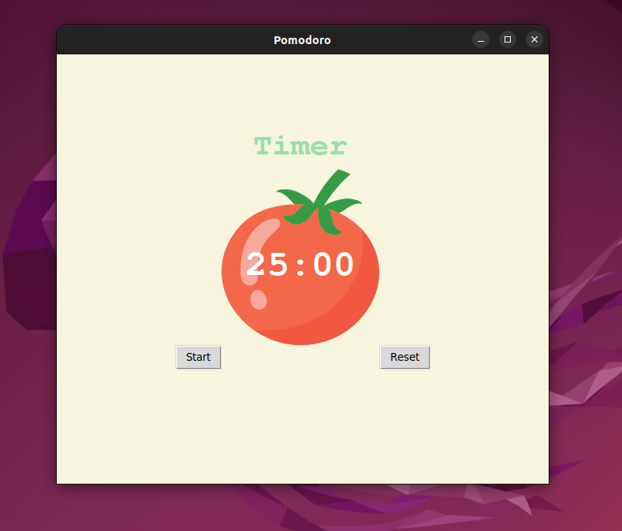

# Day 28 Progress
This day I strengthen my tkinter knowledge with a Pomodoro GUI App project. Also I also learned that Python is a strong typed and dynamic typed language. Dynamic typing means that runtime objects (values) have a type, as opposed to static typing where variables have a type. Strong typing means that the type of a value doesn't change in unexpected ways.

## Day 28 End Day Project
In my end day project I created a Pomodoro app which has a timer of 25 minutes that activates when you press start button and after each work session you have 5 minute break and after 4 work sessions you will have a 20 minute break. Your each work session is recorded as a check mark at the bottom center of the app. Reset button is used to restart the app completely sets the timer and repetitions to zero.

