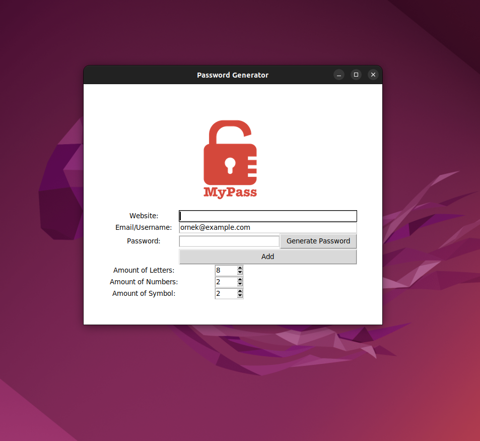

# Day 29 Progress
This day I continued to learn tkinter in python and also combined it with my file manipulation knowledge.

# Day 29 End Day Project
This day I created a similar project to one of my previous projects which was a password generator. Today I created a graphic user interface to my program and saves all your passwords
into another text file called data.txt. 

